## 🏢 Current Work (Production Environment)

Actualmente desarrollo y mantengo aplicaciones internas críticas en el sector de ingeniería de telecomunicaciones.

Mi trabajo se centra en:

- Diseño y estabilización de flujos técnicos complejos
- Integración y reconciliación de datos provenientes de múltiples fuentes externas
- Desarrollo y mantenimiento de microservicios orientados a la calidad del dato
- Automatización de procesos sensibles con especial atención a la trazabilidad y control de errores
- Implementación de lógica de negocio robusta en entornos con requisitos técnicos y regulatorios estrictos

Trabajo en backend y automatización como núcleo de mi responsabilidad, diseñando APIs y flujos de datos robustos, pero también participo activamente en el desarrollo de interfaces cuando la arquitectura lo requiere, asegurando coherencia entre lógica de negocio y experiencia de usuario.

Mi enfoque prioriza el análisis previo, la mantenibilidad a largo plazo y la fiabilidad operativa en ambos extremos del sistema.
---

## 🧭 Product Development

Además de mi trabajo en producción, desarrollo aplicaciones propias donde diseño y construyo el sistema completo: modelo de datos, arquitectura backend, lógica de negocio e interfaz.

Trabajo estos proyectos con el mismo nivel de exigencia técnica que aplico en entornos profesionales, poniendo especial atención en la claridad conceptual, la coherencia entre capas y la mantenibilidad del sistema.

## 🧠 Technical Focus

**Frontend**
- React & Next.js
- Interfaces accesibles y orientadas a la usabilidad estructural

**Backend & Data**
- Node.js / Express
- APIs REST
- Entornos SQL y NoSQL
- Validación y enriquecimiento de datos externos

**Engineering Approach**
- Diseño de flujos técnicos con control de error explícito
- Priorización de la estabilidad y trazabilidad
- Uso de IA como herramienta de análisis y refactorización, manteniendo criterio técnico propio

## 🛠 Stack Principal y Tecnologías

  
  
  
  
  &nbsp;&nbsp;&nbsp;
  
  
   
  
  

---

## 🚀 Proyectos y Portfolio

* [**Mi Portfolio Web**](https://claramanzanocorona.dev/)

---

## 📊 Mi Actividad en GitHub

  

  

### 🔗 Conexión

Estoy disponible para colaboraciones y nuevos desafíos técnicos y laborales.
